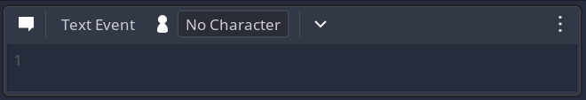

# Text Event

The text event is one of the most important ones since this will be containing most of your text.

## The header

You have up to tree different types of options here:
- **Character** - This is who will be saying the text written inside the text editor. 
- **Portrait** - If you picked a **Character** the different portraits will show up here. If that **Character** doesn't have any special portraits the default one will be used. If you pick the `(Don't change)` option, it will continue using the previous text event portrait set. If you pick the `[Definition]` option, a new picker will show up.
- **Definition** - You can select any of your **Definitions** and it will try to match that string with available portraits. This can be used to dynamically show different portraits depending of previous player input.

## The Text Editor

Inside the text editor you have special features that might not be obvious to everyone:

- Each line will create a new text message. This will help you to make longer monologues without having to add a new **Text Event** for each message. If you want to disable this, you can do so in the Dialogic settings pannel: `Settings -> Dialog -> New lines will create extra messages`.

- When writing a **Character** name, Dialogic will automatically color the text of that **Character**

- `[br]` This will add a line break in the position of the tag

- `[nw]` The *no wait* command will tell Dialogic to automatically skip the current text after it finished displaying without any user input. The default time for skipping to the next text is 2 seconds, but you can change how many seconds by setting a number to it. For instance, if you want it to wait 5 seconds you can add `[nw=5]` and 5 seconds after the dialogue finished it will go to the next event.

- `[speed=X]` You can use the *speed* tag to change change the speed of an individual text event speed. You can set for instance `[speed=10]` to show the text at a very slow pace. If you want the text to be instant for one message you can do `[speed=0]` and it will show up automatically. After the event containing the *speed* tag is over, it will go back to whatever value you have set on the current theme. Remember that the number is the interval between each letter, so the bigger the number the slower the text will be.

- `[definition]` If you have a **Definition** and you want to display its value on inside your text you can use the `[` and `]` characters and the name of your **Definition** to print it. Let's say we have a **Definition** called `Money` with the value of `5`. we can write: `You have [Money] left` and Dialogic will replace the `[Money]` tag with the value `You have 5 left`.