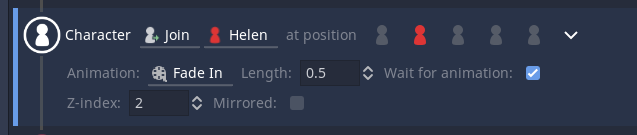

# Character Join

The character join event is used to make characters appear during a dialogue.

Select the **character** to show on the screen.
If that **character** has a **portrait** you can select one. You can change that character portrait using the portrait selector on the [Text event](./000) or by making the character join in the same position and selecting a new **portrait**.

TODO: Positions image

You can select one of the five positions. If you want to change the current position of a character you would need to add a new join event and pick a new position.

TODO: Mirror icon image

If you need to show your **character**'s portrait you can do so by selecting the mirror icon.