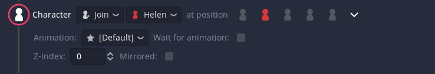

# Character Join

The character join event is used to make character portraits appear during a dialogue.

Select the **character** to show on the screen.
If that **character** has more than 1 **portrait** you can select one. You can change that character portrait using the portrait selector on the [Text event](./000) or by making the character join in the same position and selecting a new starting **portrait**.

TODO: Positions image

You can select one of the five positions. If you want to change the current position of a character you would need to add a new join event and pick a new position.

The current 5 positions are the only ones available at the moment, but more customization will come in future versions.

TODO: Mirror icon image and same portrait both regular and mirrored

By clicking on this icon, you can mirror the current character's portrait.