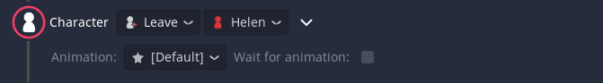
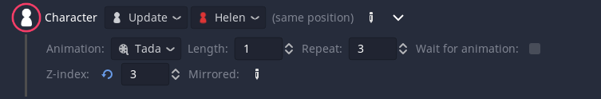

# Character Event
The character event allows you to make characters join and leave as well as animating them and changing their position.

The first setting picks the mode of the event, `join`, `leave` or `update`.

For all three you need to select a **character**. 
Similarly in all modes you can `animation` and it's `length` in the event body. The [Default] option will use the default join/leave animation that can be set on the dialogic settings page.
The `Wait for animation` setting will make sure the dialog only continues after the animation has fully played.

## Join Settings

You can select a `portrait` (if the character has more then one) and one of the five `positions`.
If you pick the [Definition] option, a new picker will show up. The portrait will be set to the value of that value definition when the dialog reaches that event. This allows for some dynamic portrait picking.

In the event body you can set the `z_index` and `mirror` the portrait. Note that the z_index only sorts the portraits and is not equivalent to the z_index on 2D nodes.

## Leave Settings

In this mode you can alternatively select the `All characters` option to make all characters leave the scene.

## Update Settings

The update settings has all the options of the join mode, but you can enable (pen icon) and disable (reset icon) each of them. Also there are other animations and you can choose to `repeat` the animation a number of times. 

If you want to know more about animations you can [read about them here](https://github.com/coppolaemilio/dialogic/blob/main/addons/dialogic/Documentation/Content/Tutorials/AddingNewAnimations.md).