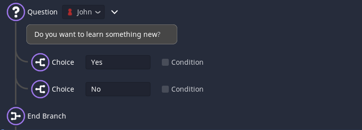

# Question Event

The `Question Event` allows your story to branch and give the player options. 
When you add a `Question Event`, two [Choice Events](./011.md) and an [End Event](./013.md) will be added automatically.

## The text editor
The block itself works very similar to a [Text Event](./001.md) and has all the options of that event.

## The choices
To add choices to your question you can add [Choice Events](./011.md). 

## Ending a question
After all your choices, there also needs to be an [End Event](./013.md).