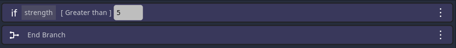

# Condition Event

The `Condition Event` allows you to set certain parts of your timelines to only play under certain conditions.

## What's a condition?
In programming and games, a condition is mostly described by variables (in Dialogic, these are called `definitions`).
This means that you can check for a definition to have a certain `value` and only play the following events if it matches.

## The settings
You can set your condition by first selecting the `value definition` that should be compared, then selecting the `type of comparison`, and finally the `value` that should be compared to.
Only the comparison types `Equal to` and `Different from` work with Strings, the rest work with integers (aka, whole numbers).
You can also enter the name of a `value definition` in the input field. This will compare to the current value of that `value definition`. 

## Adding events
You can then add new events below the Condition Event, and they will be indented and only be played when the condition is true.

## Ending a condition
Every condition needs to have an [End Event](./013.md). After that event, all following events will ignore the condition again.
When creating a Condition Event a End Event will be added too.

*Note: You can of course have conditions inside conditions. Just make sure to have the same amount of End Events*