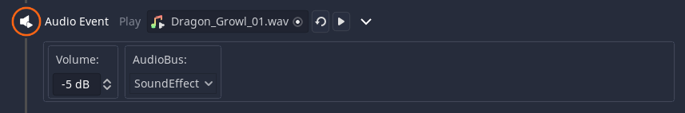

# Audio Events
*The Audio Event and Background Music Event are very similar, so they are explained together*

The `Audio Event` can be used to play sounds. In contrast, the `Background Music Event` is supposed to play long pieces. Only one background music file can be played, but it can fade from one to the next. 

## Options
Select the audio file that should be played. You can clear this selection with the garbage icon.

Then you can set a `AudioBus` to use and a preferred `volume` level. More about AudioBus' [here](https://docs.godotengine.org/en/stable/tutorials/audio/audio_buses.html).

The `Background Music Event` additionally has a option for the fade length. 

## Is the audio looping when you don't want it to?
The `Audio Event` doesn't loop by itself. In Godot, looping of audio is mostly due to how you imported it (default for .ogg files). 

To solve this: 
1. Select your audio file.
2. Go to the import tab (it's next to the scene tree tab by default)
3. Uncheck the loop checkbox.
4. Hit re-import.