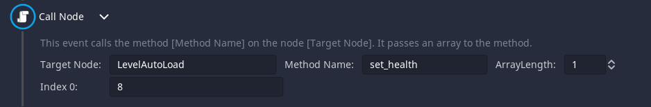

# Call Node

This event allows to call a function in a node or an autoload and pass an array to that function.

Many people struggle with the first setting the node. You will have to either put in a full path (starting from root) or a relative path. 

#### Using a relative path
*You need to have a basic knowledge of relative paths. You can learn a bit about them [here](https://docs.godotengine.org/en/stable/classes/class_nodepath.html).*
The path needs to be relative to your DialogNode. This means you need to consider where it will be added to. 
Let's for now imagine an example scene tree like this:

`- World
-- Temple
-- NPC`

Now in the NPC's script the dialog node is added as a child of the NPC node. When getting instanced, there will be a canvas layer inbetween resulting in an actual tree like this:

`- World
-- Temple
-- NPC
--- CanvasLayer
---- DialogNode`

But we want to call a function in the Temple scene with our Call Node Event. From the structure above we can see that we need to go up three times and then down one time to get from the DialogNode to the temple, so this is the resulting path:
`'../../../Temple'`

*Of course if you have canvas_layer set to false in Dialogic.start() you need on '..' less.*

#### Using the name of an autoload
If you have instead an autoload it's wonderfully easy. You can just use the name of the autoload!