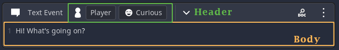

# Creating custom events

# Introduction
### What are Dialogic events?
Events are visual representation of data. Whenever you create one event in your timeline, you are modifying a dictionary with a lot of keys and values. Each pair will contain all the information needed to perform an action during the game.

### What makes a custom event?
A custom event is made up of a two main parts: the **Event Block** and the **Event Handling Script**.

The **Event Block** is the scene that will be shown in the timeline editor. It needs to inherit Dialogic's `EventTemplate.tscn` scene.

In most cases you will additionally need scenes that have all the setting controls in them. These will be the "content" of your event block. This kind of scenes will have to extend the `EventPart.gd` script.

Here is a very simple example of an `EventBlock`:

It contains two **EventParts**, a **header** and a **body**.

The **Event Handling Script** is what contains the logic and what will happen when your event happens in the game. This script will need the `handle_event()` function that will be called if the event is reached.

All of the files that are used for creating a custom Event Block and Handling Script should be in this directory: `res://dialogic/custom-events`. That way Dialogic can recognize it and show it in your timeline editor.

# Making your first custom event in 6 steps
Let's now create a simple event that will print some text to the Output panel in Godot.

## 1. Create the folder
First you should create a new folder in `res://dialogic/custom-events` and give it a name that is descriptive and unique.

For this print event let's call it `print-event`.

## 2. The folders content
Now you should go to `res://addons/dialogic/Example Assets/CustomEvents` and copy all the files from there and paste them into your new folder (In this case: `res://dialogic/custom-events/print-event`)

## 3. The EventBlock (EventBlock.tscn)
This is a scene that inherits `res://addongs/dialogic/Editor/Events/Templates/EventTemplate.tscn`.
When you open the scene you can see that all except the root node are grayed out.

**IMPORTANT!!! This file needs to be named `EventBlock.tscn`!!! DO NOT RENAME**

### Setting the EventBlock values
Now select the the root node of that scene. In the inspector you will see a couple of variables to set. 

#### EventName and icon
For now let's set the `Event Name`. I will set mine to `Print Event`.

#### The Event Data
Next you also need to think about the data that your event should save/handle. 

As said before it has to contain an `event_id`. These ids mostly consist of your "name" and a number. My event_id will be `rabloe_000`.
*We decided to move away from the actual names so that renaming wouldn't cause lots of rework.*
*Make sure your "name" is as unique as possible, so you can share custom events with others without trouble.*

For the rest of the data I just want to store a string to print. Create the default data as a dictionary in the `event_data` in the inspector.

#### Style and Icon
Now there is also already a stylebox. You can edit it (mainly the background color) to give it a unique style.
You can also select an icon for your event. The default Dialogic icon size and format is: 22x22 `svg`. You can find the icons used for the built-in events here: `res://addons/dialogic/Images/Event Icons/Main Icons`

## 4. The Event Blocks Content (EventParts)
Right now your event block will be empty so let's change that (if you want to).

The content of an EventBlock is separated as `EventParts`. This allows for some reuse.
There are two places EventParts can be in an EventBlock: The Header (always visible) and the Body (can be hidden).
*EventParts can also contain other EventParts, but it wont be necessary for most custom events.*

*An EventBlock does not have to have a body nor a header EventPart.*

There is already a simple example `EventPart` (Script and Scene) included. You can change it as much as you want.

### Loading the data
In `load_data()` you will need to set the values of your control nodes.

### Saving changes to the data
When the values get changed (listen to it via signals) set the according value in the `event_data` dictionary and call `data_changed()`.

This is pretty much all you need to know.
*If you want to find more examples you can go to `res://addons/dialogic/Editor/Events/Parts/` and look at the EventParts that shape Dialogic's default blocks.*

### Using the EventPart
Once you finished everything in your EventPart(s) you need to go into the `EventBlock` scene and set the `header`/`body` variable in the inspector to the new scene(s).

Here is how the EventBlock's settings look for me now:

## 5. The event handler script (event_yourname_000.gd)
Once you have your `EventBlock` finished, you need to add the event handling logic. 

### The correct name
Dialogic will search your handler script following the format `event_` + your event id.
So in our case, since the `event_id` is `rabloe_000` the handler scripts needs to be called **exactly** `event_rabloe_000.gd`

### The handle_event() function
If you open the script you will see, that there is only one function by default, the `handle_event()` function.

It comes with two usefull pieces of information: the `event_data` and a reference to the `dialog_node`.

For me I'll just add
`print(event_data['print_text']` 
there. But of course you can do a lot more.

Some more stuff is already explained in the script:
#### Continue
Use `dialog_node.load_next_event()` to continue with the next event.

#### Waiting
If you don't want the player to interrupt your event, set `dialog_node.waiting` to `true` while your event is handled.
Don't forget to set it back to `false`.

## 6. Using your event
You are as good as done. Just enable custom events in dialogics settings menu.
Then go into a timeline. Scroll down to the custom events section. There it should be, otherwise you should hit the refresh button.

*Go ahead and try it out!*

*Make sure to check Emilio's Discord server just in case someone has already created the custom event that you need. They are super easy to [import](./ImportCustomEvents.md)!*