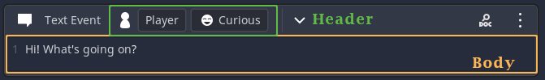
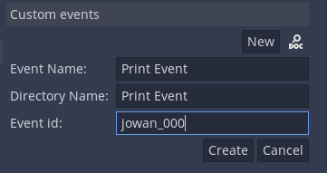
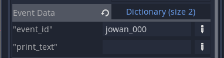

# Creating custom events

# Introduction
### What are Dialogic events?
Events are visual representation of data. Whenever you create one event in your timeline, you are modifying a dictionary with a lot of keys and values. Each pair will contain all the information needed to perform an action during the game.

### What makes a custom event?
A custom event is made up of a two main parts: the **Event Block** and the **Event Handling Script**.

The **Event Block** is the scene that will be shown in the timeline editor. It needs to inherit Dialogic's `EventTemplate.tscn` scene.

In most cases you will additionally need scenes that have all the setting controls in them. These will be the "content" of your event block. These kind of scenes will have to extend the `EventPart.gd` script.

Here is a very simple example of an `EventBlock`:

It contains two **EventParts**, a **header** and a **body**.

The **Event Handling Script** is what contains the logic and what will happen when your event happens in the game. This script will need the `handle_event()` function that will be called if the event is reached.

All of the files that are used for creating a custom Event Block and Handling Script should be in this directory: `res://dialogic/custom-events`. That way Dialogic can recognize it and show it in your timeline editor.

# Making your first custom event in 6 steps
Let's now create a simple event that will print some text to the Output panel in Godot.

## Create the event
Go to the `settings page` and in the `custom events section` hit the `New` button. 
Fill in a name for your event, a folder name and an ID. For the IDs, I recommend using your name or a string unique to you followed by a number. 
**The ID has to be different for every event!!!**
This is why I recommend the unique string, as it will enable you to share the event with others without breaking their games.

When you are ready, hit `Create`. You will see the folder appear in the `FileSystem` under `res://dialogic/custom-events/`. 

If you go to the `timeline editor` now, you should already be able to see your event in the event list.

### What happened
This little menu already created a number of things for you:
- The `EventBlock` (EventBlock.tscn)
- An example `EventPart` (EventPart_Example.gd/.tscn)
- The `event handling script` (event_+EVENTID+.gd)
- A `stylebox` for your event (Stylebox.tres)

## What next
The automatic process already set up a lot, but it didn't know the purpose of our event, so we will have to add that.

### | Adding the data
First we want to open the `EventBlock.tscn` scene. (Do not rename this scene!)

Select its root node and look at its exported variables in the inspector.

We will need to add all the data that our event can have to `event_data`.
As you can see, it already contains your event id. This needs to be there, so don't delete it!

I want to be able to set the text that will be printed when my event is activated, so I'll add an information slot for that:

### | Icon and Stylebox
You can also change your events icon in the Inspector. Just drag an image into the `Event Icon`.

Below that, you can open the Stylebox and change its background color to give your event a unique look.

### | The Event Blocks Content (EventParts)
Right now your event block will be empty, so let's change that if you want to.

The content of an EventBlock is separated into `EventParts`. This allows for some reuse.
There are two places EventParts can be in an EventBlock: The Header (always visible) and the Body (can be hidden).

*An EventBlock does not have to have a body nor a header EventPart. For example the End Branch event has none.*

There is already a simple example `EventPart` (Script and Scene) included. You can change it as much as you want.

#### | Loading the data
In `load_data()` you will need to set the values of your control nodes. This function is called when the event is added to the timeline editor.

#### | Saving changes to the data
When the values get changed (listen to it via signals) set the according value in the `event_data` dictionary and call `data_changed()`.

This is pretty much all you need to know.
*If you want to find more examples you can go to `res://addons/dialogic/Editor/Events/Parts/` and look at the EventParts that shape Dialogic's default blocks.*

### | Using the EventPart
Once you've finished everything in your EventPart(s) you need to, go into the `EventBlock` scene and set the `header`/`body` variable in the Inspector to the new scene(s).

### | The event handler script (event_yourname_000.gd)
Once you have your `EventBlock` finished, you need to add the event handling logic. 

#### | The handle_event() function
If you open the script you will see, that there is only one function by default, the `handle_event()` function.

It comes with two useful pieces of information: the `event_data` and a reference to the `dialog_node`.

For me I'll just add
`print(event_data['print_text']` 
there, but of course you can do a lot more.

Some more stuff is already explained in the script:
##### Continue
Use `dialog_node.load_next_event()` to continue with the next event.

##### Waiting
If you don't want the player to interrupt your event, set `dialog_node.waiting` to `true` while your event is handled.
Don't forget to set it back to `false`.

## And done!
Great, you've created your first custom event for Dialogic. 

*Make sure to check Emilio's Discord server just in case someone has already created the custom event that you need. They are super easy to [import](./ImportCustomEvents.md)!*