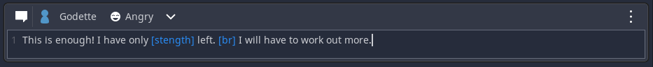

# Text Event

The text event is used to make text appear in the dialog-box. 

You can specify a **character**. The characters name will be shown. 
You can also select a **portrait**, if the selected character has more then one.
To make your character show up in the game you need to have used a [character join](./001) event first.

Inside the text field you can use [br] to create a line break. 
You can also use definitions by putting their name in brackets.
If you use the name of an Extra Information definition inside the text, the player can hover it (if enabled in the current theme).