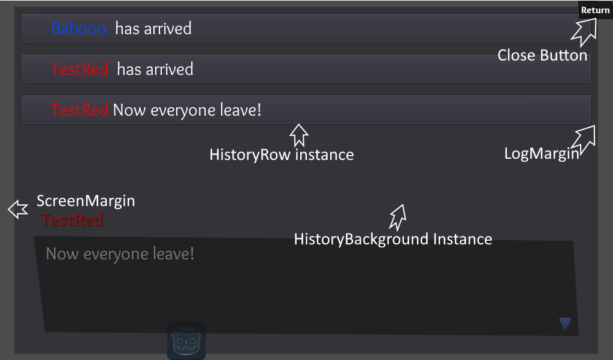
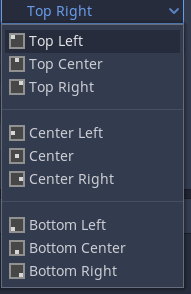
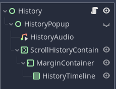
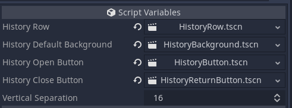
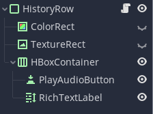
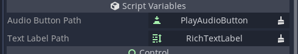

# History timeline

When enabled, the History timeline feature automatically builds a log of events that can be reviewed by the user or, if audio is enabled, replay the audio as well. The History timeline is at its core an opinionated, fancy logging system, and has many settings that can be configured to change its behavior. In addition to these settings, the history timelines look and feel can also be customized further by intermediate to experienced users, without affecting its functionality.



The above image gives a rough look at how a history timeline can look in game. By default, a History timeline is made up of a *History* node that instances a single *HistoryBackground*, two *HistoryButtons*, and as many *HistoryRows* as neccesary. The History timeline is destroyed along with the rest of the Dialogic node when the timeline ends.

## History settings
Unless otherwise noted, all settings are enabled by default.

### Enable history
Allows history logs to be taken. If disabled no other history settings will be displayed, and no history log will be kept in game

### Show open button
Displays the default history open button. This button opens the history timeline and disappears while it is open. Its position is determined by the History button position setting. If you wish to customize this button, refer to the History anatomy below

### Show close button
Displays the default history close button. This button closes the history timeline and disappears while it is closed. Its position is determined by the History button position setting. If you wish to customize this button, refer to the History anatomy below 

### Log all choices
Record all possible choices the player could have picked from a choice event in the format: 
*\[choice 1\] \\t \[choice 2\] \\t \[choice 3\] \\t*

If you need this format changed, the code can be found here:
https://github.com/coppolaemilio/dialogic/blob/5e99dfe0374695ff4ec3680bad75d17ffe939264/addons/dialogic/Nodes/History.gd#L236-L237

### Log choice answer
Record the choice ultimately selected by the player in a choice event in the format: 
*\\t \<choice goes here\>*

If you need this format changed, the code can be found here:
  https://github.com/coppolaemilio/dialogic/blob/5e99dfe0374695ff4ec3680bad75d17ffe939264/addons/dialogic/Nodes/History.gd#L244
  
### Log character joins
Record when a character joins a timeline in the format:
*\<display name of character\> \<character join Text\>*
  
Which by default displays as:
  *Emilio has arrived*

### Log character joins text
The text to display after a character name when a character arrives. This defaults to 'has arrived'. This option has no effect if Log character joins is disabled
   
### Log character leaves
Record when a character leaves a timeline in the format:
*\<display name of character\> \<character leave Text\>*

Which by default displays as:
*Emilio has left*

### Log character leaves text
The text to display after a character name when a character leaves. This defaults to 'has left'. This option has no effect if Log character leaves is disabled

### Scroll to bottom
Auto scrolls the history timeline to the most recent entry. Disable this if you wish for your player to start reading from the first entry and have to scroll down manually

### Reverse timeline
Add new HistoryRows to the top of the history timeline, reversing the default way the timeline is built. This option is **disabled** by default

### Show name colors
Use the color defined in the character within the timeline 


In this case the characters name woudld be blue in the history timeline. Disable this option to force character names to use the default font color.

### Line break after names
Forces the character name to be logged on a separate line from the rest of the text. This option is **disabled** by default

### History button position
Choose the relative location on screen you want the default history open and default history close button to appear



If you wish to customize this further, consider using the exposed *toggle_history* function described in History API below

### Name delimiter
Type in the 'delimiter' to be affixed to the character name in the history timeline. By default this is a colon *\:* which would display as:
*Emilio: Welcome to dialogic!*

Changing this to a dash *\-* would display as:
*Emilio- Welcome to dialogic!*

### Screen margin
Sets a distance in pixels that the history panel will buffer away from the edge of the screen. 


This example would give a margin of 25 pixels on the left and right sides of the screen (X axis) and 10 pixels on the top and bottom of the screen (Y axis)

### Log margin
Sets a distance in pixels that the history panel will buffer away from the HistoryRows that it contains.


This example would give a margine of 45 pixels on the left and right sides of the screen (X axis) and 15 pixels on the top and bottom of the screen (Y axis). Note that the Y axis pixels may not be as apparent as the scrollcontainer may obscure the bottom margin.

## History anatomy


The History node is a child of the DialogicNode and is made up of an AudioStreamPlayer to replay TextEvent audio and a ScrollContainer to ultimately hold HistoryRow instances. Neither of these nodes have much cause to be changed or customized.



The History node has four exposed script variables that are instanced at run time and can be customized, changed, or extended to suit your needs. These default parts can all be found in the */addons/dialogic/Example Assets/History/* folder.

### History background
There is no special code and few considerations when replacing or customizing the HistoryBackground. Its simply a panel with *mouse_filter* set to ignore.

### HistoryButton and HistoryReturnButton
There is no special code or considerations when replacing either button. The only difference in these buttons are the Button texts. The buttons have their own theme that can be replaced, overridden, or ignored

### HistoryRow


If you intend to replace the HistoryRow, make sure to extend the script. HistoryRow contains two important functions
* add_history(historyString : string, newAudio='') - Called to actually write the data to the HistoryRow by the main History node. Edit this function with care.
* load_theme(theme: ConfigFile) - called by the History node to theme the HistoryRow with the default theme of Dialogic. If you wish to style your HistoryRow manually, than replace this functions content with a *pass*.

The key nodes of the HistoryRow are the *RichTextLabel* which is where the actual text appears and the *PlayAudioButton* which allows replays of audio dialog in TextEvents. In the case of customizing your own HistoryRow, you will need to set the node path of these nodes which can be done via the script varialbes as seen below



## History api
There is one exposed function in Dialogic that relates to the History system: toggle_history(). Toggle history is used to create your own custom button or function to open and close the History window. It is called like this:
*Dialogic.toggle_history()*
And can easily be tied to a button or function like so:

```
func _on_CustomHistoryButton_pressed():
    Dialogic.toggle_history()
```