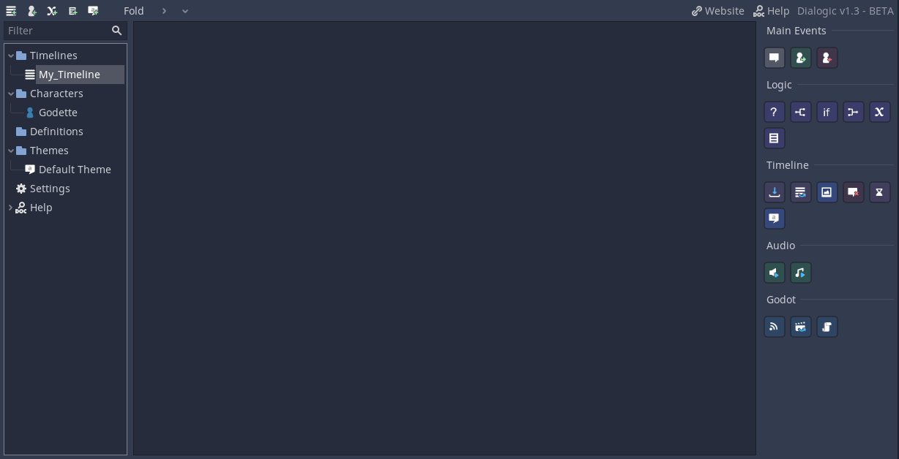
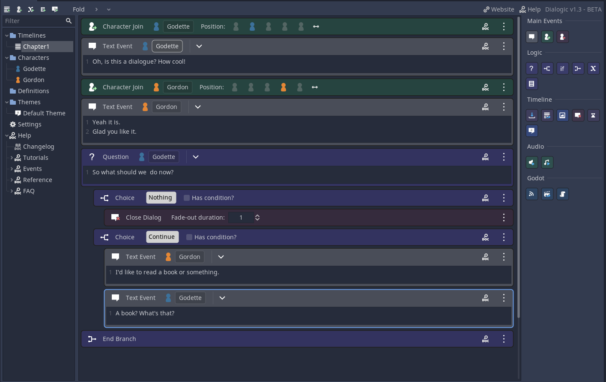

# Beginners Guide
Let's begin creating your first dialog with Dialogic!

## 1. Meeting the Dialogic tab
All the things related to your dialogue will be done in the Dialogic tab. You can access it like the 2D and 3D tab on the very top of the editor. 

Let's have a look into the `toolbar` at the top.

### | The resources
Here you can create Dialogic's five **resources**. You will hear more on each of them later. 

**Timelines** represent a list of events. Show characters, make them talk, change the background, ask questions, emit signals, and more!

**Characters** can have name, a special color, and different images for expressions.

**Value Definitions** that can be used as variables to branch your story or be used inside the texts. 

**Glossary Entries** that can contain information that is shown in a popup when the player hovers over the word.

**Themes** that specify how your dialogue is looking. There are many settings you can tweak to suit your need.

### | The master tree
All your resources are shown in the big `master tree` on the left. You can select on which you want to work there, create sub folders and move the items by dragging them.

*Let's continue! What is the most important thing for a dialogue? Someone to talk to. So we will create our first character.*

--------------------

## 2. Creating your first character
Click the little character icon in the toolbar to create a new character. You will see the `character editor` now. 
### | Name
You can instantly type in the `name`, the character should have. Hit enter to set the name.

### | Color
Go ahead and also set a `color`, by clicking on the color block.

### | A default portrait/expression
Next let's add a default `portrait` for them. You can select a file by clicking the tree dots.
If you do not have a image to use right now, you can use the example dwarf from the `Example Assets folder` inside the Dialogic folder (res://addons/dialogic/Example Assets/portraits).

This is all for now. You can create as many characters as your story needs.

*Now let's create our first dialogue!*

--------------------

## 3. Creating your first timeline
Timelines specify what events happen in which order. Create a new timeline with the icon in the toolbar.
You can now see the `timeline editor`. 

### | Name
Go ahead and give it a `name`. You can do so right after creating or double-click the item in the tree. 

### | Adding your first event
You can find all possible `events` on the right.

Go ahead and add a `Text` event (the very first, grey button), by clicking it or dragging it into the timeline area.

The `Text` event is what will make text appear on the dialog box.
You can select a character that will say the text. Go ahead and let your character say something!

### | More events!
Now we also want our character to be visible in the scene. For that, we use the `Character Join` event (the second, green event).

Select what character should appear and at which of the 5 available positions.

Make sure the new event is above the Text event. If it's not, you can drag it up (alternatively you can select the event and use `ALT+UP`/`ALT+DOWN`).

### | Create your dialog
Now go ahead and try out the other events. If you want to learn more about them, click the little help button on them!

FYI: new events get added below the currently selected one.

If you want to delete an event use `DEL` key.

After some time your dialogue might look something like this:

*Now your dialog is ready to be played! But how? Let's find out!*

--------------------

## 4. Adding your first DialogNode to a scene

There are two ways of doing this, using gdscript or the scene editor.

### | Instancing the scene using gdscript
Using the `Dialogic` class you can add dialogs from code easily:

`
var new_dialog = Dialogic.start('Your Timeline Name Here')
add_child(new_dialog)
`

### | Instancing the scene using the editor
Using the editor, you can drag and drop the scene located at `/addons/dialogic/Dialog.tscn` and set the current timeline via the inspector.

### | Run, game, run!
If you have done one of the previous steps, run your game (F5). I hope you will see your dialog appear. If not check if you missed something. You can also always ask for help on the discord.

*Before you start to make your own dialog, let us introduce some more cool things!*

--------------------

## 5. Making your first value and glossary entry
This is already pretty cool, but let's make things more complex. We mentioned them earlier but here they are: `values` and `glossary entries`.

### | Make a value
Create a new `value` by clicking the X-icon in the toolbar. You will now see the definition editor.

Here you can give your value a name and a default value.
Now you can use that value in your dialogues. You can:
- change it with the Set Value event
- use it to have conditions (Condition event)
- add conditions to choices
- display it in texts by writing [MyValue]

#### Example value
Here an example value ...

... and how it might be used in a timeline.

### | Make a glossary entry
An `glossary entry` is used for extra information. If the name of this is used in a text or question event, the player can hover it and it will show a popup with the given information. You can also change the information during the game with the `Set Glossary` event.

#### Example glossary entry
Here is an example glossary entry...

... and how it looks in the game.

*If you don't like the look of this box, don't worry. The next section is about customizing the look of your dialogue!*

--------------------

## 6. Create your first dialog theme
Themes are used to change the look. By default you already have a theme. Let's start by clicking it. 
You will now see the `theme editor`.

It has a preview at the top, and all the settings - grouped into multiple tabs - at the bottom.
I won't explain all the settings here. You can open the `Theme Editor Reference` if you wonder about one of the settings. 

The most important one is the Dialog Box's `Box Size`. If you are making a pixel-art game with a small resolution you will have to change it to be much smaller. Also change the font size to fit your games size.

--------------------

## Behind the scenes
If you wonder how all of this works, here is some (very) short explanation.

All the resources are saved as `.json` or `.cfg` in a Dialogic folder in your games root directory `res://dialogic/`.

Boom. There you go :). I'm to lazy to explain more.