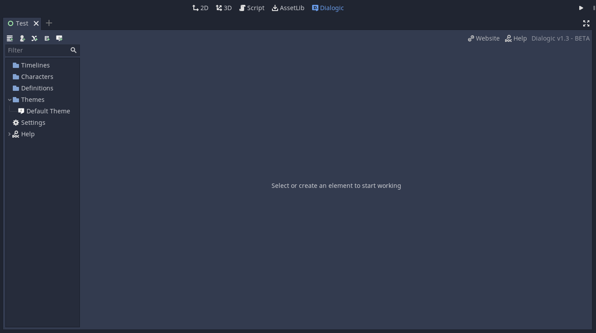
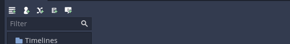

# Beginners Guide
Let's walk you through creating dialogue with Dialogic!

## 1. Meeting the Dialogic tab
Everything related to dialogue will be done in the Dialogic tab. You can access it like the 2D and 3D tab at the very top of the editor. 

Let's have a look at the `toolbar` at the top.

### | The resources
Here you can create Dialogic's five **resources**. You will hear more on each of them later. 

**Timelines** represent a list of events. Show characters, make them talk, change the background, ask questions, emit signals, and more!

**Characters** can have name, a special color, and different images for expressions.

**Value Definitions** that can be used as variables to branch your story or be used inside the texts. 

**Glossary Entries** that can contain information that is shown in a popup when the player hovers over the word.

**Themes** that specify how your dialogue looks. There are many settings you can tweak to suit your need.

### | The master tree
All your resources are shown in the big `master tree` on the left. You can select which you want to work with there, create sub folders, and move items by dragging them.

*Let's continue! What's the most important thing in dialogue? Someone to talk to. So, let's create our first character.*

--------------------

## 2. Creating your first character
Click the little character icon in the toolbar to create a new character. This will take you into the `character editor`. 
### | Name
When creating a character, you may start typing in the `name` that the character should have. Hit enter to set the name. You can also double-click on their icon in the Character list on the left to set it.

### | Color
Go ahead and also set a `color` by clicking on the color block.

### | A default portrait/expression
Next, let's add a default `portrait` for them. You can select a file by clicking the three dots to the right of the blank path. You can also set a name for the expression on the left.
If you do not have a image to use right now, you can use the example dwarf from the `Example Assets folder` inside the Dialogic folder (res://addons/dialogic/Example Assets/portraits).

This is all for now. You can create as many characters as your story needs.

*Now, let's create our first dialogue timeline!*

--------------------

## 3. Creating your first timeline
Timelines specify what events happen in which order. Create a new timeline with the icon in the toolbar.
You can now see the `timeline editor`. 

### | Name
Go ahead and give it a `name`. You can do so right after creating or double-click the item in the tree. 

### | Adding your first event
You can find all possible `events` on the right.

Go ahead and add a `Text` event (the very first, grey button), by clicking it or dragging it into the timeline area.

The `Text` event is what will make text appear on the dialog box.
You can select a character, and this will add their `name` above the dialogue box. Go ahead and let your character say something!

### | More events!
If we also want our character to be visible in the scene, we use the `Character Join` event (the second, green event).

Select what character should appear and at which of the 5 available positions. This will add their character to the scene. The portrait position is approximate, and can be adjusted by setting their offset in their Character Editor.

Make sure the new event is above the Text event. If it's not, you can drag it up (alternatively you can select the event and use `ALT+UP`/`ALT+DOWN`).

### | Create your dialogue
Now go ahead and try out the other events. If you want to learn more about them, click the little help button on them! This will open up the documentation for that item.

Keep in mind that, when adding new events with their buttons, they get added beneath the currently selected one.

If you want to delete an event use `DEL` key or click the three dots on the right and select `Remove`.

After a little effort, your dialogue tree might look something like this:

*Now your dialogue tree is ready to be played! But how? Let's find out!*

--------------------

## 4. Adding your first DialogNode to a scene

You can add dialogue trees - in the form of Dialog nodes - by one of two ways: gdscript or the scene editor.

### | Instancing the scene using gdscript
Using the `Dialogic` class, you can add dialogue trees from code easily:

`
var new_dialog = Dialogic.start('Your Timeline Name Here')
add_child(new_dialog)
`

### | Instancing the scene using the editor
Using the editor, you can drag and drop the scene located at `/addons/dialogic/Dialog.tscn` and set the current timeline via the inspector.

### | Run, game, run!
Once you've done one of the previous steps, run your game (F5) or the scene (F6). Check to see if your dialogue begins. If not, check to see if you missed a step. If you're still having trouble, or just want to let us know what you think, you can always join us on our Discord channel.

*Now that you've mastered the basics, let's introduce some more cool things!*

--------------------

## 5. Making your first value and glossary entry
This is already pretty cool, but let's make things more complex. There are two other resources that can help provide greater flexibility to your dialogue timelines: `values` and `glossary entries`.

### | Make a value
Create a new `value` by clicking the X-icon in the toolbar. This will open up the definition editor.

This allows you to set a name for your value and a default value.
Now you can use this value in your timelines. You can:
- change it with the Set Value event
- use it to have conditions (through the Condition event)
- add conditions to choices
- display it in text by writing [MyValue]

#### Example value
Here an example value ...

... and how it might be used in a timeline.

### | Make a glossary entry
A `glossary entry` is used for extra information. If the name of this is used in a text or question event, the player can hover over it with their indicator, and it will show a popup with the given information. You can also change the information during the game with the `Set Glossary` event.

#### Example glossary entry
Here is an example glossary entry...

... and how it looks in the game.

*If you don't like the look of this box, don't worry. The next section is about customizing the look of your dialogue!*

--------------------

## 6. Create your first dialog theme
Themes are used to change the look. By default you already have a theme. Let's start by clicking it. 
You will now see the `theme editor`.

It has a preview at the top, and all the settings - grouped into multiple tabs - at the bottom.
I won't explain all the settings here. If you need additional information about a setting, the `Theme Editor Reference` can help you out.

One of the most important settings is the Dialogue Box's `Box Size`. If you are making a pixel art game with a small resolution you will have to change it to be much smaller. You can also change the font size to fit your game's size.

--------------------

## Behind the scenes
To get an idea for how all of this is built and operated, all the resources are saved as `.json` or `.cfg` in a Dialogic folder in your games root directory `res://dialogic/`.
