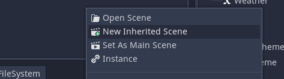

# Creating custom events

While dialogic offers many useful events out of the box, it can be very usefull to add a couple of custom ones for your project.

Before you go ahead and do a lot of work you should first ask on emilios discord server, if someone has already created one that does what you want. They are super easy to [import](./ImportCustomEvents.md).

### What are events
Events are essentially a dictionary with information. There is only one key that this dictionary has to have, the `'event_id'`. This is how dialogic finds out which event this is.
This dictionary is what is saved. So all the rest is just about setting the values of that dictionary with values and then evaluating them and doing something with them during the game.

## Introduction
A custom event is made up of a couple of parts:

### The event block
... is the scene that will be shown in the timeline editor. It needs to inherit dialogics EventTemplate.tscn scene (more on that later).

In most cases you will additionally need scenes that have all the setting controls in them. These will be the "content" of your event block.
These scenes will have to extend the EventPart.gd script. You can use an easy script template. 

### The script
... is what contains the logic: what will happen when your event happens in the game.
This script will need one function the `handle_event()` function that will be called if the event is reached.

### The folder
All of the files that are used for the event block and when the event is handled should be in one folder. This folder needs to be in `res://dialogic/custom-events`, so dialogic can recognize it as a custom event.

## Make your first custom event
In this walkthrough I will create a print event that takes an input and prints it into the console. You can try to do whatever you want or follow the steps.

## Create the folder
First you should create a new folder in `res://dialogic/custom-events` and give it a name that is descriptive and unique.

I will name mine `PrintEvent`.

## Create the EventBlock
Now we will create the event block. For this you will need to navigate into `res://addongs/dialogic/Editor/Events/Templates`.

Right click the `EventTemplate.tscn` and choose: `New Inherited Scene`.

A new scene will open, but it will already contain some nodes. Most of them should be greyed out. Save this scene to the folder we just created. 
!!! It needs to have the name `EventBlock.tscn`!!!

Now select the the root node of that scene. In the inspector you will see a couple of variables to set. 

For now let's set the `Event Name`. I will set mine to `Print Event`.

Great. Now a bit of information:

### About EventBlocks and EventParts
The content of an event is seperated as `EventParts`. This allows for some reuse.
There is to places EventParts can be in an EventBlock: The Header and the Body.

EventParts can also contain other EventParts, but it wont be necessary for most custom events.

Here is a very simple example of an EventBlock:

This header EventPart actually contains two seperate EventParts: the CharacterPicker and the PortraitPicker.`

An EventBlock doesn not have to have a body or a header EventPart.

An EventPart can be every Control node and can contain as many other nodes as it wants. The script of the EventPart has to extend `res://addons/dialogic/Editor/Events/Parts/EventPart.gd`.

Let's create a simple EventPart!

### Creating an EventPart
You should think about whether you want to use this EventPart as a header (only horizontal) or as a body. 
We'll just create a new scene and choose a contol node.

I want to create a header, so I'll choose a HBoxContainter. I'll call it EventPart_Print. Now I'll add a LineEdit. If you want your line edit to look like the others in the dialogic editor you can instance the `res://addons/dialogic/Editor/Events/Parts/Text/CustomLineEdit.tscn` scene (A specially styled line edit). That's what I'll do.

Now I'll save my scene into my custom events folder.

Next I'll create a script on the main node. Remember this scene is supposed to handle the data of your event. I'll call mine `EventPart_Print`

To make this as easy as possible there is an example script that we'll just copy and then change a bit. You can copy the following code or find it at `res://addons/dialogic/Editor/Events/Parts/ExampleEventPartScript.gd`.

`tool
extends "res://addons/dialogic/Editor/Events/Parts/EventPart.gd"
 # has an event_data variable that stores the current data!!!

 ## node references
 # e.g. 
onready var input_field = $Box/InputField

 # used to connect the signals
func _ready():
	# e.g. 
	input_field.connect("text_changed", self, "_on_InputField_text_changed")
	pass

 # called by the event block
func load_data(data:Dictionary):
	# First set the event_data
	.load_data(data)
	
	# Now update the ui nodes to display the data. 
	# e.g. 
	input_field.text = event_data['my_text_key']

 # has to return the wanted preview, only useful for body parts
func get_preview():
	return ''

 ## EXAMPLE CHANGE IN ONE OF THE NODES
func _on_InputField_text_changed(text):
	event_data['my_text_key'] = text
	
	# informs the parent about the changes!
	data_changed()`

When you copied this into your script you need to make only a couple of changes, depending how many settings your EventPart has.

In the load_data function you need to take the info from the event_data and show it in your settings.

For each setting you will need to react to it's changes by setting the values and then call `data_changed()` (a function of the EventPart.gd).
You can see how this is done in the example.

