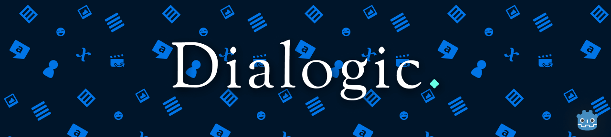

Welcome to the Help pages. You can find all the information available on how to use the plugin and its parts.  

If you are looking for something specific, you can use the filter in the upper left. If you need extra help you can join [Emilio's Discord server](https://discord.gg/v4zhZNh)!

# Support the project on [Patreon](https://www.patreon.com/coppolaemilio)

# Index
## Events
- [Text event](./Events/000)
- [Character Join](./Events/001)
- [Character Leave](./Events/002)
- [Question Event](./Events/010)
- [Choice Event](./Events/011)
- [Condition Event](./Events/012)
- [End Event](./Events/013)
- [Set Value](./Events/014)
- [Audio Events](./Events/030)
- [Emit Signal](./Events/040)
- [Change Scene](./Events/041)
- [Call Node](./Events/042)

## FAQ
- [Can I use C# with Dialogic?](./FAQ/CSharp.md)
- [Portraits not showing in game?](./FAQ/Portraits.md)
- [Using signals?](./FAQ/Signals.md)

## Reference
- [Dialog node](./Reference/000.md)
- [Dialog Class](./Reference/001.md)
- [Character Editor](./Reference/Character.md)
- [Theme Editor](./Reference/Theme.md)

## Tutorials
- [Beginners Guide](./Tutorials/BeginnersGuideStepByStep.md)
- [Full Documentation (old)](./Tutorials/DefaultDocs.md)

# Dialogic is made by:
## [Emilio Coppola](https://github.com/coppolaemilio)
## [Jowan-Spooner](https://github.com/Jowan-Spooner)
### [Arnaud Vergnet](https://github.com/arnaudvergnet)
### [ellogwen](https://github.com/ellogwen)
### [Tim Krief](https://github.com/timkrief)
### [AnidemDex](https://github.com/AnidemDex)
### [zaknafean](https://github.com/zaknafean)
#### And many [more](https://github.com/coppolaemilio/dialogic/graphs/contributors)!

# License
MIT License
Copyright (c) 2020 Emilio Coppola

Permission is hereby granted, free of charge, to any person obtaining a copy of this software and associated documentation files (the "Software"), to deal in the Software without restriction, including without limitation the rights to use, copy, modify, merge, publish, distribute, sublicense, and/or sell copies of the Software, and to permit persons to whom the Software is furnished to do so, subject to the following conditions: The above copyright notice and this permission notice shall be included in all copies or substantial portions of the Software.

THE SOFTWARE IS PROVIDED "AS IS", WITHOUT WARRANTY OF ANY KIND, EXPRESS OR IMPLIED, INCLUDING BUT NOT LIMITED TO THE WARRANTIES OF MERCHANTABILITY, FITNESS FOR A PARTICULAR PURPOSE AND NONINFRINGEMENT. IN NO EVENT SHALL THE AUTHORS OR COPYRIGHT HOLDERS BE LIABLE FOR ANY CLAIM, DAMAGES OR OTHER LIABILITY, WHETHER IN AN ACTION OF CONTRACT, TORT OR OTHERWISE, ARISING FROM, OUT OF OR IN CONNECTION WITH THE SOFTWARE OR THE USE OR OTHER DEALINGS IN THE SOFTWARE.